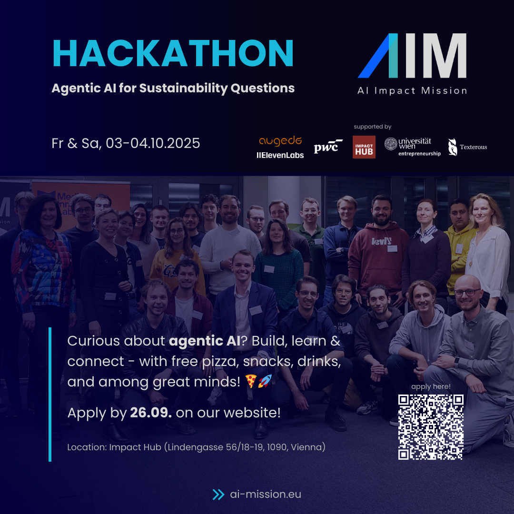
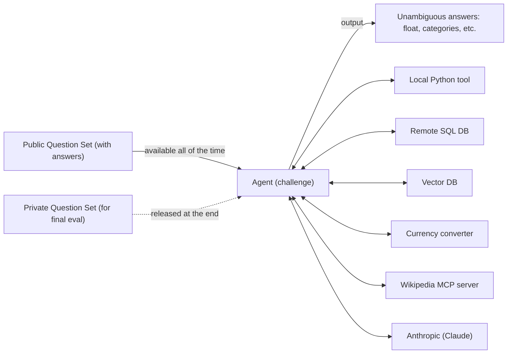

# AIM Hackathon - Agentic AI for Sustainability Questions
4th of October 2025

[//]: # ()

## Getting Started
1. Clone repository
2. Change ".env.template" to ".env" and add your Anthropic API key
3. Set up the package manager [uv](https://docs.astral.sh/uv/getting-started/installation/): `pip install uv`
4. Set up environment with uv: `uv sync`
5. Add new packages (as with pip): `uv add <package-name>`

## Start Developing (Hints)
1. Start with the agent.py file
1. Start small -> e.g. answer easy SQL questions
2. Evaluate from the beginning
   - submit to the public leaderboard only 1-3 questions to get familiar with the process and format
3. Then go big, one step at a time
   - add easy Wikipedia questions
   - add easy PDF questions
   - then medium, then hard

## Big Picture

## Leaderboard and Submission
- [Main page](https://hackathon-server.ashysand-de33d6c5.westeurope.azurecontainerapps.io/)
- [All API endpoints](https://hackathon-server.ashysand-de33d6c5.westeurope.azurecontainerapps.io/docs)
- [Leaderboard page](https://hackathon-server.ashysand-de33d6c5.westeurope.azurecontainerapps.io/leaderboard)
  - showing the best submission of each team only
- To check validity of your submission json, use the validation endpoint `/check-submission`
- To submit your results during the event, use the submission endpoint `/submit`
- To submit your **final results of the private set**, use the submission endpoint `/submit-private`

## Nice reads
* [Develop with Claude API](https://docs.claude.com/en/docs/get-started#python)
* [Claude JSON Mode](https://docs.claude.com/en/docs/test-and-evaluate/strengthen-guardrails/increase-consistency)
* [Building Effective Agents](https://www.anthropic.com/engineering/building-effective-agents)
* [Claude Agent SDK](https://www.anthropic.com/engineering/building-agents-with-the-claude-agent-sdk)
* [Model Context Protocol (MCP)](https://modelcontextprotocol.io/docs/develop/build-server)
* [Claude Embeddings](https://docs.claude.com/en/docs/build-with-claude/embeddings)
